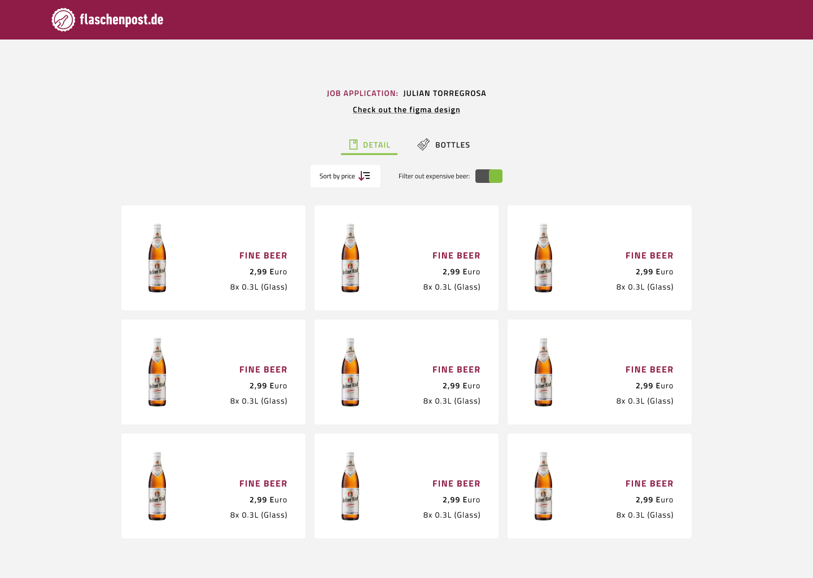
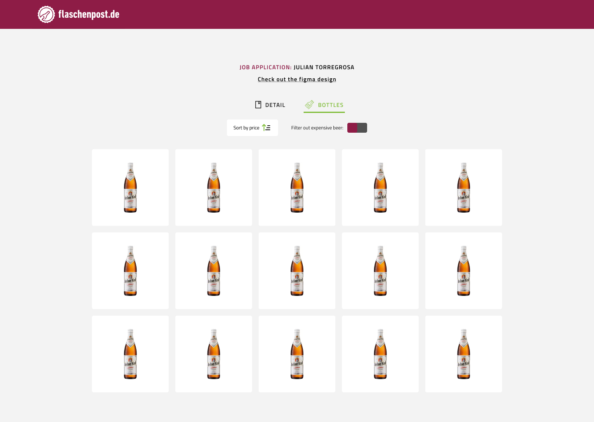
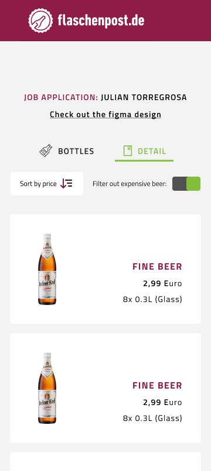
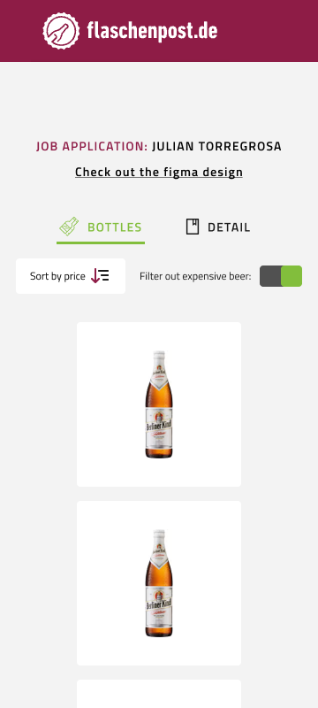

# Flaschenpost

Job Application

## Description

Create a Web-Site that

- acts both as a mobile and desktop optimized web-page to display products
  (see mocks below).
- feel free to design and/or choose an appealing layout based on the mocks yourself.
- use the URL of our API below to get product data including URLs to images.
- is responsive whereas the layout can go up to a maximum width of 1260 pixels, centered on
  the screen.
- can switch between two different styles of views as seen in the mocks below via a button at
  the top bar. The two options are:

  - The detail view (default). Which includes Image, Name and Price.
  - The bottle view. Which renders only the images (which are all bottles) next to each
    other.

- offers a button to sort the result by price and toggle ascending and descending order.
- offers a toggle button to filter out beers which are more expensive than 2 euro per litre.

  You are invited to use and include whatever assets you find from our actual websites (as long as you
  don’t host them publicly) to further style and beautify this project. You may use any tools that you
  like to accomplish this task, including build/dependency management, IDE/editor, libraries, etc.
  We should be able to build and run your project without needing to make any changes to it. Feel free
  to provide a very simple set of instructions on how to start the project.
  The URL for the JSON-Data is the following:

https://flapotest.blob.core.windows.net/test/ProductData.json

## How to run

1. `npm install`
1. `npm start`

## Running test suite

1. `npm run test`

## Designs

I took the mock ups and created a simple design prioritizing flaschenpost styling, brand colors, etc.

Figma link: https://www.figma.com/file/1QOdqHl4mpKUJAWvm0AA7H/Flaschenpost?node-id=0%3A1&t=HJPzYKDb6Fe6uZTj-0

### Desktop design

### Mobile design

